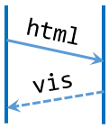

=======
htmlvis
=======

.. image:: https://img.shields.io/travis/qdamian/htmlvis.svg
        :target: https://travis-ci.org/qdamian/htmlvis
        :alt: Build Status

.. image:: https://coveralls.io/repos/github/qdamian/htmlvis/badge.svg?branch=master
        :target: https://coveralls.io/github/qdamian/htmlvis?branch=master

.. image:: https://www.quantifiedcode.com/api/v1/project/0bb0e06a69bf441191265e664e049fb0/badge.svg
        :target: https://www.quantifiedcode.com/app/project/0bb0e06a69bf441191265e664e049fb0
        :alt: Code issues

.. image:: https://readthedocs.org/projects/htmlvis/badge/?version=latest
        :target: https://htmlvis.readthedocs.io/en/latest/?badge=latest
        :alt: Documentation Status

.. image:: https://landscape.io/github/qdamian/htmlvis/master/landscape.svg?style=flat
        :target: https://landscape.io/github/qdamian/htmlvis/master
        :alt: Code Health

.. image:: https://pyup.io/repos/github/qdamian/htmlvis/shield.svg
        :target: https://pyup.io/repos/github/qdamian/htmlvis/
        :alt: Updates

.. image:: https://img.shields.io/pypi/v/htmlvis.svg
        :target: https://pypi.python.org/pypi/htmlvis
        :alt: Pypi Status

HTML visualization for Python

Helps you visualize your app's HTTP traffic using sequence diagrams generated by
the amazing PlantUML_.

* Free software: MIT license
* Documentation: https://htmlvis.readthedocs.io

Features
--------

* Support for Requests_
* `Formatting`_

Usage
-----

Capturing packets with Requests
+++++++++++++++++++++++++++++++

.. code-block:: python

    import htmlvis
    import requests

    requests_sniffer = htmlvis.RequestsSniffer(client_name="browser")
    requests.get('https://foo.com/bar', hooks={'response': requests_sniffer})

Capturing packets with Bottle
+++++++++++++++++++++++++++++

.. code-block:: python

    import htmlvis
    import bottle

    bottle_sniffer = htmlvis.BottleSniffer(server_name="webserver")
    bottle.install(bottle_sniffer)

Generating a sequence diagram
+++++++++++++++++++++++++++++

.. code-block:: python

        htmlvis.seqdiag('sample.html', sniffers)

Sample use case
---------------

We're building an activity_recommendations_service.py_.

Credits
---------

The initial version of this package was created with Cookiecutter_ and the `audreyr/cookiecutter-pypackage`_ project template.

.. _Bottle: https://bottlepy.org/docs/dev
.. _Cookiecutter: https://github.com/audreyr/cookiecutter
.. _PlantUML: http://plantuml.com/
.. _Requests: http://docs.python-requests.org
.. _activity_recommendations_service.py: examples/recommendations_service/activity_recommendations_service.py
.. _`audreyr/cookiecutter-pypackage`: https://github.com/audreyr/cookiecutter-pypackage
.. _`Formatting`: docs/formatting.rst
